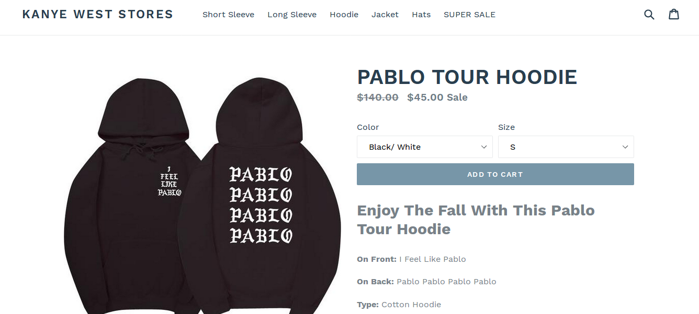
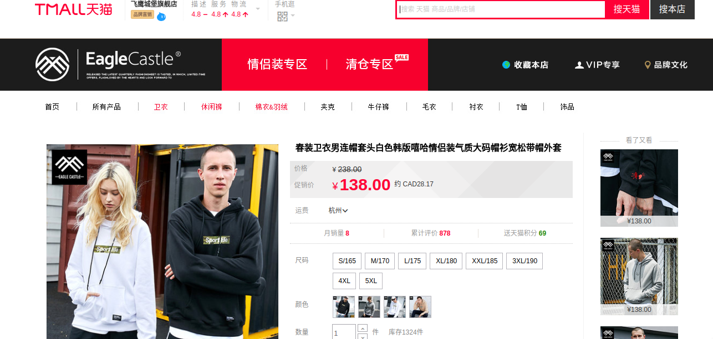

# Catch Me On TaoBao

### Getting Started

To get started on the backend:

Make sure you have NodeJS installed, and install StdLib, and well as the required JS packages in the `package.json`.

To run locally, run with `lib http`

To deploy, run `lib up dev` and `lib release`

To use the Chrome extension:

Go to `chrome://extensions/`, and press `Load unpacked extensions...` and select the `/Chrome` folder in the project.
